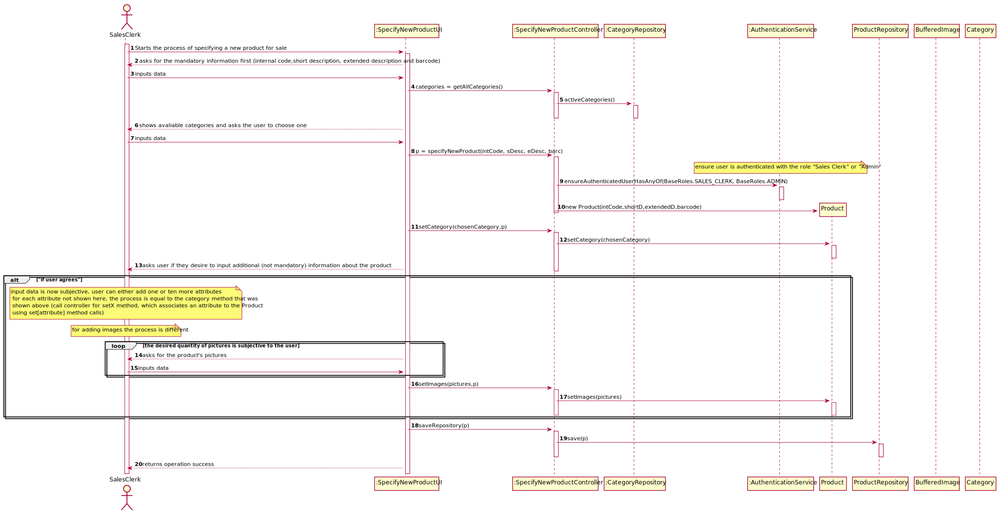
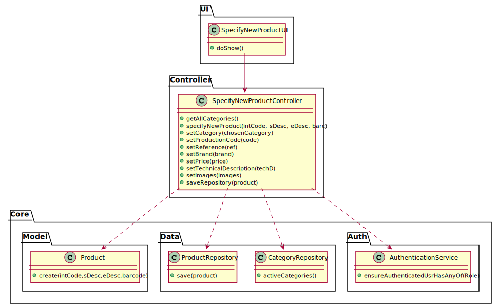

# US-1001
=======================================

# 1. Requirements

**US1001** As Sales Clerk, I want to specify a new product for sale.

This user story is dependant on US1005 - For a product to be created, there need to be avaliable created categories so that the product can be associated

# 2. Analysis

- photo: it might be of any common format (e.g. png, jpeg, svg);

- short description: not empty having 30 chars maximum;

- extended description: not empty with a minimum of 20 chars and 100 chars maximum;

- technical description: multiple lines of text, preferably with no limit or the biggest possible.

- brand: not empty having 50 chars maximum;

- reference: not empty alphanumeric code with at 23 chars maximum;

- production code: not empty alphanumeric code with at 23 chars maximum however it might meet a given regular expression defined/configured at deployment time.

- internal code: not empty alphanumeric code with at 23 chars maximum however it might meet a given regular expression defined/configured at deployment time.

Mandatory attributes: internal code, short and extended description.

# 3. Design

## 3.1. Realização da Funcionalidade

*Nesta secção deve apresentar e descrever o fluxo/sequência que permite realizar a funcionalidade.*

## 3.2. Diagrama de Classes

## 3.3. Padrões Aplicados

MVC
## 3.4. Testes 
*Nesta secção deve sistematizar como os testes foram concebidos para permitir uma correta aferição da satisfação dos requisitos.*

**Teste 1:** Verificar que não é possível criar uma instância da classe Produto com atributos nulos, vazios ou inválidos.

    @Test(expected = IllegalArgumentException.class)
    public void ensurecInternalCodeMustNotBeEmpty(){
        System.out.println("must have non-empty code");
        new Product("",shortDescription,extendedDescription,barcode);
    }

    @Test(expected = IllegalArgumentException.class)
    public void ensureInternalCodeMustNotBeNull(){
        System.out.println("must have non-null code");
        new Product(null,shortDescription,extendedDescription,barcode);
    }
    @Test(expected = IllegalArgumentException.class)
    public void ensureInternalCodeMustNotHaveMoreThan23Chars(){
        System.out.println("must have less than 23 chars");
        new Product("foasdjkpoifjkadsjdfisoajfijadoijfidjsfdsjfsdij",shortDescription,extendedDescription,barcode);
    }
**Teste 2:** Verificar que dois produtos com o mesmo ID são iguais

    @Test
    public void ensureCreatedProductsAreTheSameWithTheSameInternalCode(){
    final Product instance = new Product(internalCode,shortDescription,extendedDescription,barcode);
    final Product instance2 = new Product(internalCode,new Description("different"),extendedDescription,new Barcode("barcode891234"));
    
    assertTrue(instance.sameAs(instance2));
        }      

**Teste 3:** Verificar que qquando um produto é criado, encontra-se ativo

    @Test
    public void ensureCreatedProductIsActive(){
        final Product instance = new Product(internalCode,shortDescription,extendedDescription,barcode);
        final boolean state = instance.isActive();
        instance.setActive(false);

        assertEquals(!state, instance.isActive());
    }

# 4. Implementação

*Nesta secção a equipa deve providenciar, se necessário, algumas evidências de que a implementação está em conformidade com o design efetuado. Para além disso, deve mencionar/descrever a existência de outros ficheiros (e.g. de configuração) relevantes e destacar commits relevantes;*

*Recomenda-se que organize este conteúdo por subsecções.*

**Interface para escolher imagens para a criação do produto**

