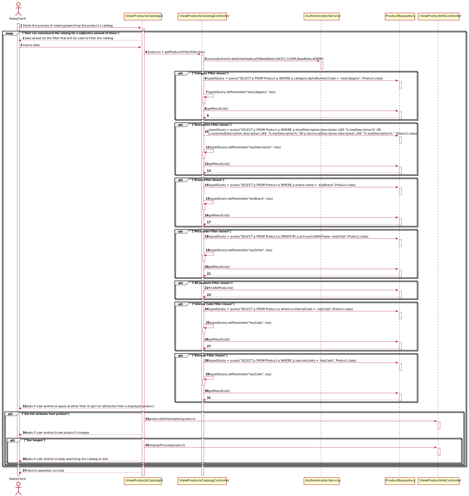
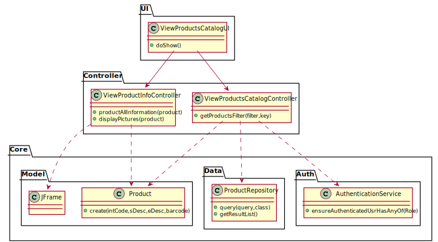

# US-1002
=======================================

# 1. Requirements

**US1002** As Sales Clerk, I want to view/search the products catalog.

This user story is not dependant on other US.

# 2. Analysis

The "product catalog" corresponds to all products that can be ordered by customers.

Commonly fields used to filter products are:

Category
Description (any of the available descriptions)
Brand
User should select/specify a data presentation order. This applies to any similar US.

At least the product' code, short description, brand, category and unit price should be presented.

More details can be presented for a given/selected product at user request.

1. Data to be used to filter the products catalog content should be asked ahead.

2. Regarding presentation order, the necessary data can be asked either: ahead and after presenting them.

# 3. Design

## 3.1. Realização da Funcionalidade

*Nesta secção deve apresentar e descrever o fluxo/sequência que permite realizar a funcionalidade.*

## 3.2. Diagrama de Classes

## 3.3. Padrões Aplicados

MVC

# 4. Implementação

*Nesta secção a equipa deve providenciar, se necessário, algumas evidências de que a implementação está em conformidade com o design efetuado. Para além disso, deve mencionar/descrever a existência de outros ficheiros (e.g. de configuração) relevantes e destacar commits relevantes;*

*Recomenda-se que organize este conteúdo por subsecções.*

# 5. Integração/Demonstração

*Nesta secção a equipa deve descrever os esforços realizados no sentido de integrar a funcionalidade desenvolvida com as restantes funcionalidades do sistema.*

# 6. Observações

*Nesta secção sugere-se que a equipa apresente uma perspetiva critica sobre o trabalho desenvolvido apontando, por exemplo, outras alternativas e ou trabalhos futuros relacionados.*

