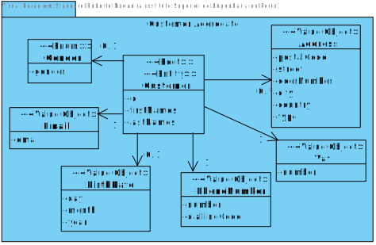
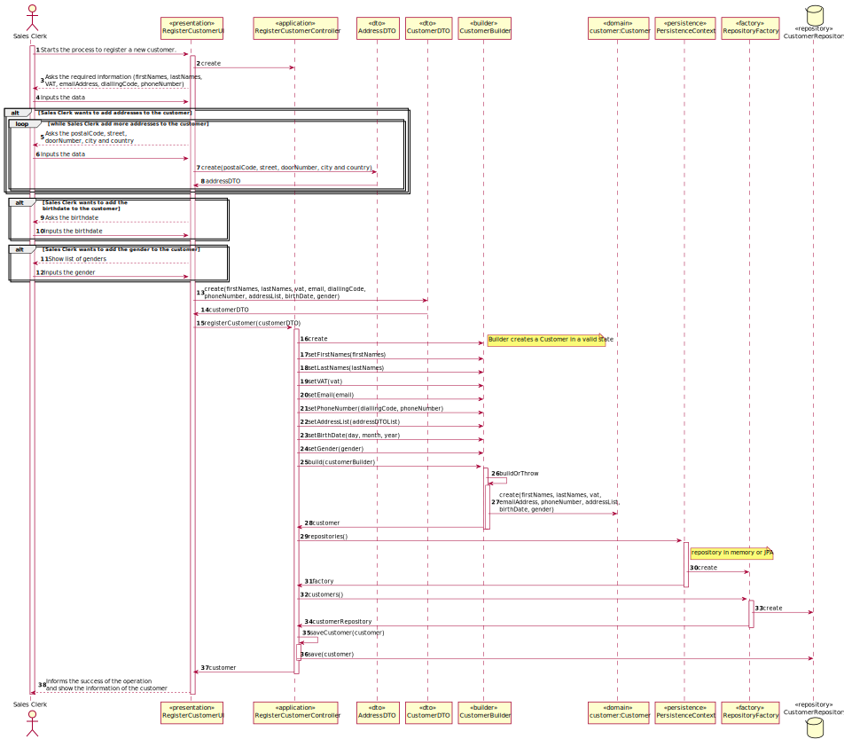
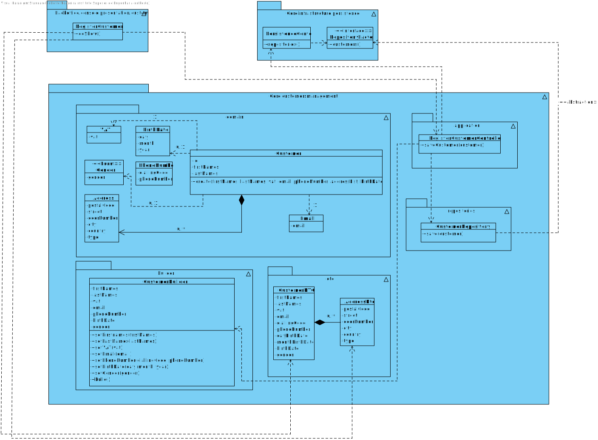

# US1003 - Register a Customer
=======================================

# 1. Requirements

* This functionality is to be implemented in the backoffice application, and will be mostly used by Sales Clerk.

**Q&A with the client**

> **Question:** Does the customer (client) need to have an address when creating? Or initially this field may be empty and only need address when it requests a purchase.
>
> **Answer:** Regarding customers, the minimum required information is its name, a valid Value-Added Tax (VAT) identifier, an email address, and a phone number.

> **Question:** Name - should we consider first name, last name or is there anything more worth capturing? Are there length restrictions?
>
> **Answer:** Name: at least a first and last name is required. Although, desirably the customer should specify his/her full name. Considering this, apply the min/max length you consider as reasonable to meet this requirement.

> **Question:** VAT id- which length should it have? Is it only digits or could there be letters?
>
> **Answer:** VAT ID varies from one country to another. Usually it has letters and numbers (cf. here). The system must be prepared to support/recognize several VAT Ids.

> **Question:** Phone number: which lenght/format?
>
> **Answer:** Phone number: according to international standards (e.g.: +351 934 563 123).

> **Question:** Birthday - in which format?
>
> **Answer:** Birthday: it is a date... you can adopt year/month/day.

> **Question:** Address - What kind of format are we expecting for these? Street name, door number, postal code, city, country is a valid format or are we missing anything?
>
> **Answer:** Address: I think you said it all.

> **Question:** When creating a customer, should it be automatically associated with a login, that is, when entering its data, such as name, and so it is necessary to enter a username and a password? 
>   It says: "The registration is manually performed by a clerk. No account activation is required." 
>   However then it also says this: "Create credential for a customer. At any time, clerks might request the system to generate access credentials to a given customer access the system. The generated credentials are sent by email to the customer and are never shown to the clerk." 
>   Should these features be implemented together?
>
> **Answer:** There are two distinct scenarios here:
> 1. The customer is registering him/herself in the system (cf. Use Case 3.1.4a). In this scenario, credentials are generated as soon as the account activation process is successfully completed.
> 2. A clerk is registering customers either manually or by importing files (cf. Use Case 3.1.4b and 3.1.4c respectively). In this scenario no account activation process is required and/or performed. Moreover, by default, no customer credentials are to be generated. If such credentials are needed, the clerk undergoes on another use case (cf. Use Case 3.1.5).
>   As you already figure it out, it is an excellent idea that at the end of use case 3.1.4b to ask the clerk if (s)he want to perform the use case 3.1.5.

# 2. Analysis

## 2.1 What is needed to Register a Customer:

* **Minimum required information:**
    * Name
    * VAT
    * Email Address
    * Phone Number

* **Optional information:**
    * Addresses (billing or delivering)
    * Birthdate
    * Gender
    
## 2.2 Relevant Domain Model

The following model represents what is needed to accomplish the functionality, in therms on domain concepts.

As seen in the diagram above, the Customer is the root of the aggregate and is an entity. 
Customer has various Value Objects, like Gender, Email, BirthDate, PhoneNumber, VAT and Address.

# 3. Design

This functionality will be used by Sales Clerk, a UI will be added to the backoffice application.
In the core, a new package called Customer Management will be added, and it will contain the controller, domain classes
and persistence. To persist necessary data for this functionality, mainly the Customer information, a Customer repository will be needed.

## 3.1. Sequence Diagram

## 3.2. Class Diagram

## 3.3. Patterns

As every other functionality, this one will follow the architecture defined for the application.
User Interfaces will be in the backoffice app package, controllers and domain will be on the
core package. Persistence classes such as the CustomerRepository implementations will be on the
Persistence Package, although the interface will remain in the core.

## 3.4. Tests

**Test 1:** Check if postal code is valid. In this example, three situation that the postal code is invalid.

    @Test
    void testPostalCode(){
        IllegalArgumentException exception1 = assertThrows(IllegalArgumentException.class, () -> {
            Address address = new Address("Rua da Cedofeita", "45501128", 317, "Paiva", "Portugal", "Billing Address");
        });
        assertEquals(exception1.getMessage(), "Postal Code invalid.");
        IllegalArgumentException exception2 = assertThrows(IllegalArgumentException.class, () -> {
            Address address = new Address("Rua da Cedofeita", "455-128", 317, "Paiva", "Portugal", "Billing Address");
        });
        assertEquals(exception2.getMessage(), "Postal Code invalid.");
        IllegalArgumentException exception3 = assertThrows(IllegalArgumentException.class, () -> {
            Address address = new Address("Rua da Cedofeita", "455-0128", 317, "Paiva", "Portugal", "Billing Address");
        });
        assertEquals(exception3.getMessage(), "Postal Code invalid.");
    }

**Test 2:** Test if the VAT is valid. In this example, three examples that the vat is invalid.

    @Test
    void invalidFormat(){
        IllegalArgumentException exception1 = assertThrows(IllegalArgumentException.class, () -> {
            VAT vat = new VAT("P123489");
        });
        assertEquals(exception1.getMessage(), "VAT number has an incorrect format.");
        IllegalArgumentException exception2 = assertThrows(IllegalArgumentException.class, () -> {
            VAT vat = new VAT("PT1");
        });
        assertEquals(exception2.getMessage(), "VAT number has an incorrect format.");
        IllegalArgumentException exception3 = assertThrows(IllegalArgumentException.class, () -> {
            VAT vat = new VAT("PT1234567891011");
        });
        assertEquals("VAT number has an incorrect format.", exception3.getMessage());
    }

**Test 3:** Check if date is valid.

	@Test
    public void dateFormatInvalid(){
        IllegalArgumentException exception = assertThrows(IllegalArgumentException.class, () -> {
            BirthDate birthDate = new BirthDate(40, 7, 2002);
        });
        assertEquals("Invalid date.", exception.getMessage());
    }

# 4. Implementation

*The implementation follows the design presented above, Unit Tests are also implemented. 

# 5. Integração/Demonstração

*The implementation of this User Storie is very important because it saves important customer data, such as billing and delivering addresses, and required to associate orders with the customer.*

# 6. Observações

*Customers register was done only with customer information. If the customer needs credentials for access to the application, this functionality must be implemented (3.1.5, mentioned by client) and the customer needs to be a user in the application.*

