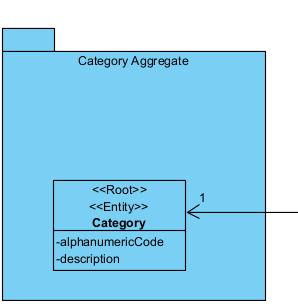
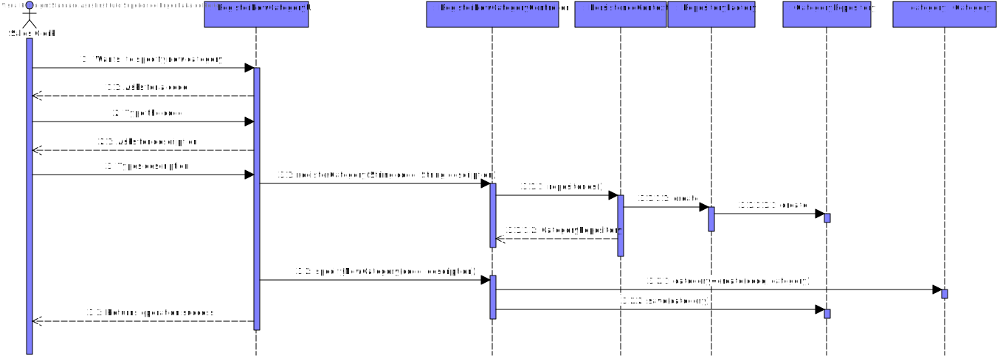
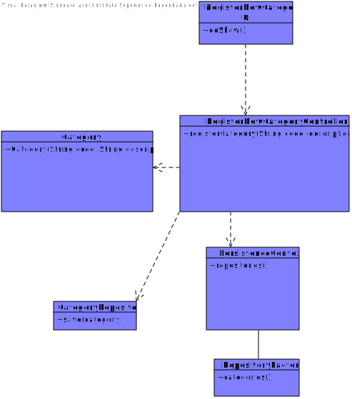

# US-4002-Assigning product orders to AGVs
=======================================

# 1. Requirements

**US4002** As Project Manager, I want that the "AGVManager" component is enhanced with a basic FIFO algorithm to automatically assign tasks to AGVs.

This User story depends on US1004-"As Sales Clerk, I want to create a new products order on behalf of a given customer." and 
US2002-"As Warehouse Employee, I want to configure the AGVs available on the warehouse." because there should be Available AGVs as well as products orders.
# 2. Análise

The team took the initiative to make some questions regarding the simultaneous use of both US2003 & US4002.(https://moodle.isep.ipp.pt/mod/forum/discuss.php?d=16394)

The team also took attention to others students questions(https://moodle.isep.ipp.pt/mod/forum/discuss.php?d=16326)

With all these inputs the team understood that the US should assign available AGVs to product orders that are ready to be assigned. Also this User Story won't work
simultaneously with US2003. 

# 3. Design

*Nesta secção a equipa deve descrever o design adotado para satisfazer a funcionalidade. Entre outros, a equipa deve apresentar diagrama(s) de realização da funcionalidade, diagrama(s) de classes, identificação de padrões aplicados e quais foram os principais testes especificados para validar a funcionalidade.*

## 3.1. Realização da Funcionalidade

## 3.2. Diagrama de Classes

## 3.3. Padrões Aplicados

Foi aplicado o padrão Repository na classe CategoryRepository para esconder detalhes da persistência dos dados.

## 3.4. Testes 
*Nesta secção deve sistematizar como os testes foram concebidos para permitir uma correta aferição da satisfação dos requisitos.*

**Teste 1:** Verificar que não é possível criar uma instância da classe Category com valor vazio

    @Test(expected = IllegalArgumentException.class)
    public void ensureAlphanumericCodeMustNotBeEmpty(){
        System.out.println("must have non-empty code");
        new Category("","categoria produtos");
    }
**Teste 2:** Verificar que não é possível criar uma instância da classe Category com valor null

    @Test(expected = IllegalArgumentException.class)
    public void ensureAlphanumericCodeMustNotBeNull(){
        System.out.println("must have non-null code");
        new Category(null,"categoria produtos");
    }

**Teste 3:** Verificar que não é possível criar uma instância da classe Category com uma descricao que nao cumpre as restricões.

    @Test(expected = IllegalArgumentException.class)
    public void ensureCategoryDescriptionHasMoreThan20Chars(){
        System.out.println("Has that identity");
        final String id = "alpha01";
        final String description = "alpha";
        final Category instance = new Category(id, description);
    }

# 4. Implementação

*Nesta secção a equipa deve providenciar, se necessário, algumas evidências de que a implementação está em conformidade com o design efetuado. Para além disso, deve mencionar/descrever a existência de outros ficheiros (e.g. de configuração) relevantes e destacar commits relevantes;*

*Recomenda-se que organize este conteúdo por subsecções.*

# 5. Integração/Demonstração

*Nesta secção a equipa deve descrever os esforços realizados no sentido de integrar a funcionalidade desenvolvida com as restantes funcionalidades do sistema.*

# 6. Observações

*Nesta secção sugere-se que a equipa apresente uma perspetiva critica sobre o trabalho desenvolvido apontando, por exemplo, outras alternativas e ou trabalhos futuros relacionados.*

