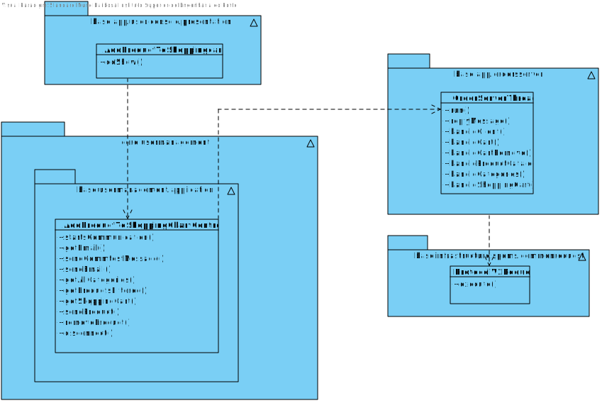

# US1501 - As Customer, I want to view/search the product catalog and be able to add a product to the shopping cart.
=======================================

# 1. Requirements

* This functionality is to be implemented in the user application, and will be used by Costumer.

# 2. Analysis

## 2.1 What is needed to represent the warehouse:

* Length
* Width
* Square
* All AGV Docks
* All Aisles and Sub Aisles
* AGVs

## 2.2 Relevant Domain Model

The following model represents what is needed to accomplish the functionality, in therms on domain concepts.

* As seen in the diagram above, it is composed by 3 agregates, Costumer, shopping cart and product.

# 3. Design

This functionality will be used by Costumer, a UI will be added to the user application.
This functionality will communicate each minute with the Order Server to get all Products.

## 3.1. Sequence Diagram

## 3.2. Class Diagram

## 3.3. Patterns

As every other functionality, this one will follow the architecture defined for the application.
User Interfaces will be in the user app package, controllers and domain will be on the
core package. Server will be in the Order server package

# 4. Implementation

* The implementation follows the design presented above.

# 5. Integração/Demonstração

* The implementation of this User Story is very important because can represent the user adding items to the shopping cart
# 6. Observações

* There is still work to do on the Dashboard to enhance its functionalities.

