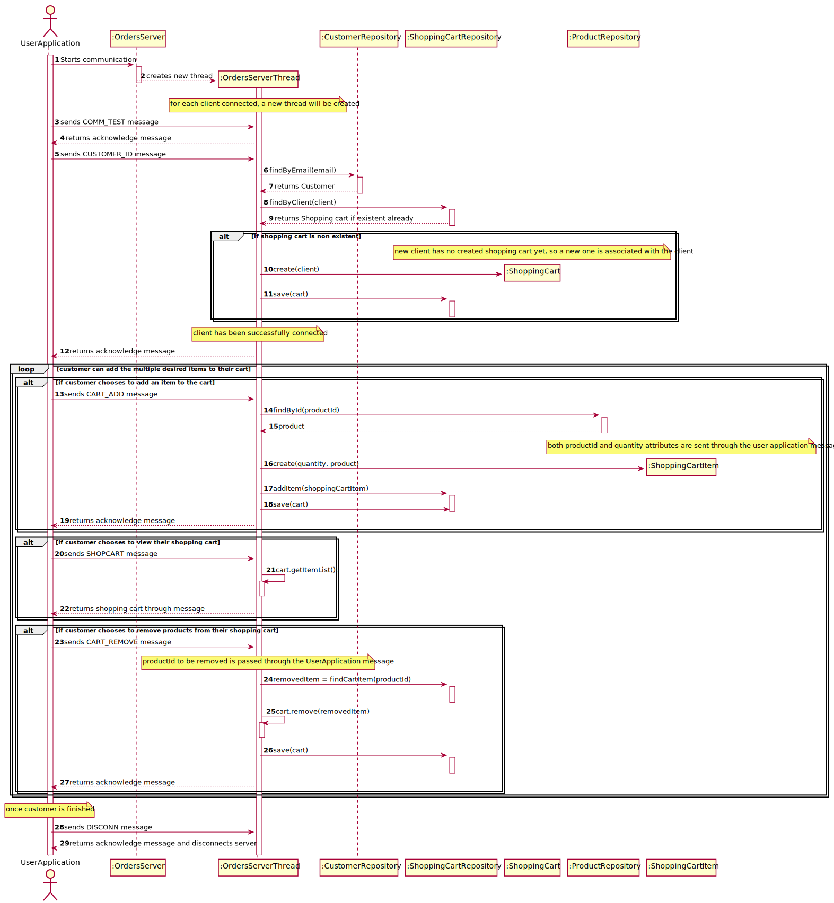
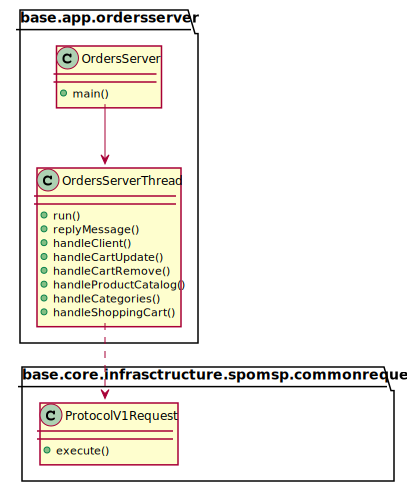

US1901 - Create the 'OrdersServer' component
=======================================

# 1. Requirements

* This is a server application that will support the Customer application.
* Communications with and from the User App must follow the SPOMSP communication protocol.
* The Customer will send the desired messages to the server
* The server will answer correspondingly 

# 2. Design

New communication messages codes will be added to the SPOMS Protocol.
An important **note** is that, in the data section, strings of characters must be surrounded by quotes and numbers like integers and doubles should not have them.

| Code | Meaning                                                                                                                                                                                                                                      |
|:----:|:---------------------------------------------------------------------------------------------------------------------------------------------------------------------------------------------------------------------------------------------|
|  12   | **CART_ADD** - Message sent from the Customer Application. It needs to have data in the following format: ProductId;Quantity.  An ACK message is returned to the Customer app if the request was successful. *Adds item to shopping cart* |
|  13  | **CART_REMOVE** - Message sent from the Customer Application. It needs to have data in the following format: ProductId;.  An ACK message is returned to the Customer app if the request was successful. *Removes item from shopping cart* |                                               |
|  14   | **CUSTOMER_ID** - Message sent from the Customer Application. It needs to have data in the following format: CustomerEmail;.  An ACK message is returned to the Customer app if the request was successful. *Connects Customer to session* |                                                                                     |
|  15   | **CATALOG** -  Message sent from the Customer Application. It needs to have data in the following format: CatalogFilter;Key.  An ACK message is returned to the Customer app if the request was successful. *Returns filtered product's catalog*|                               |
|  16   | **CATEGORIES** -  Message sent from the Customer Application. Returns avaliable categories. An ACK message is returned to the Customer app if the request was successful. |                              |
|  18   | **SHOPCHART** - Message sent from the Customer Application. Returns customer's shopping cart. An ACK message is returned to the Customer app if the request was successful. |                    |

The design of this server application is divided in several sections according to features that are needed to support other applications needs.

The following sequence diagram shows how a normal communication between the server and the client happens. It always starts with a
'commTest' by the client and an acknowledgment reply by the server. Likewise, it always ends with a disconnect request by the client and an acknowledgment
by the server. In between these messages, the communication happens. 

The first message sent by the Custommer App will always be message no.14 - so that the customer is correctly connected to the server
and their shopping cart is flawlessly displayed.

The other messages sent vary on the customer's desires.

## 2.1 US2003 Server support

### 2.1.1. Sequence Diagram
 Communication between the customer's Application and the Orders Server is well seen on the following diagram

## 2.2 Class Diagram

* Worth noting that for every new TCP connection received in the server, a new thread is created to continue the
  communication without blocking the server and eventually other messages that could come from other clients.

# 3. Implementation

Core domain classes such as ShoppingCart and ShoppingCartItem were created in order to satisfy the needs of this functionality.

A repository for shopping carts was added to ensure persistence.

# 4. Integration/Demonstration

This application is fundamental when it comes to the Customer's App reliability. It assures all communication between these two components
is made in an effective and reliable way.

# 5. Observations

Future implementations to the server may be needed, according to the Customer's additional desires, the Orders Server must always 
satisfy the Customer's Application needs, otherwise, both are useless

