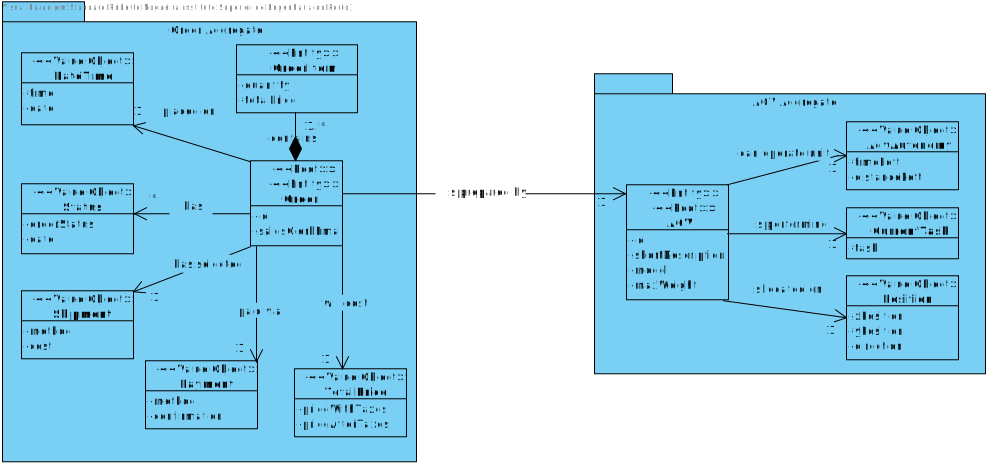
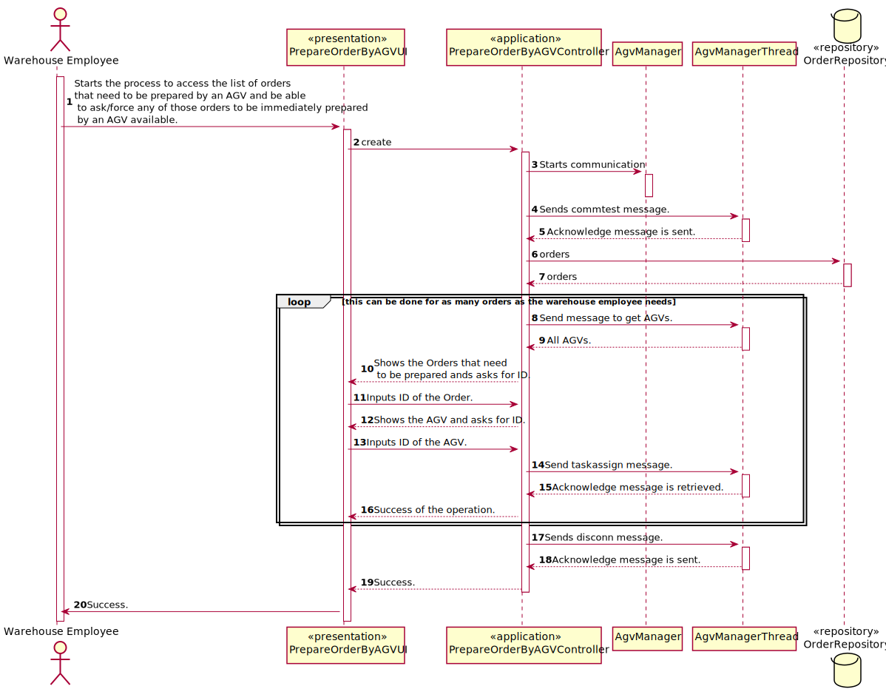
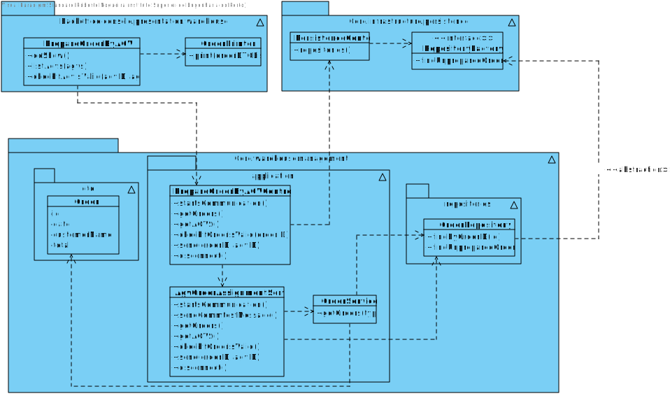

# US2003 - As Warehouse Employee, I want to access the list of orders that need to be prepared by an AGV and be able to ask/force any of those orders to be immediately prepared by an AGV available.
=======================================

# 1. Requirements

* This functionality is to be implemented in the backoffice application, and will be used by Warehouse Employee.

**Q&A with the client**

> **Question:** It is mentioned that the warehouse is able to force a certain task to a certain AGV, but can this only happen when the AGV is free, or can the warehouse employee cancel a task and assign a new one.
>
> **Answer:** In the scope of US 2003, the AGV is selected by the warehouse employee from the ones that are available and are able to perform the task. Tasks cannot be manually cancelled.

> **Question:** How would you like the dashboard to look? A simple list of the AGVS along with its position and status?
>
> **Answer:** No! Preferably, the dashboard should be an approximation to what is depicted on Figure 8 of the specifications document.

> **Question:** Despite in the provided sprint user stories asking for the digital twin in a web dashboard along with its status and position, in user stories of the next sprint it is said that the development of the movement of the AGV is needed which causes a minor confusion. My question is in this sprint is it required to create the movement of the AGV?
>
> **Answer:** On Sprint C, the web dashboard needs to be thought and ready to show the current AGVs position, which is read from some where. Further, on sprint D, when simulating the AGV movement the AGV position will change and, therefore, we will be able to see the AGVs position changing accordingly on the web dashboard. Notice that, this is an integrative project developed following an iterative and incremental process. So, at the end, the pieces need to fit well together.

> **Question:** Regarding this feature, what would you consider to be its complete state, that is, what would be the criterion to define whether or not this feature was functional?
>
> **Answer:** The warehouse employee is able to (i) select an order that needs to be prepared; (ii): select the AGV from the ones that are available and able to perform the task; (iii) the task is sent to the selected AGV and (iv) the order change its status.

> **Question:** Knowing that in US2003 it is only mentioned that the Warehouse Employee will do this action, I would like to know if it is part of the System to allow users with greater skills and responsibilities (Warehouse Managers or Admins) to also perform the same task? If yes, which users?
>
> **Answer:** No! There is not such need.

> **Question:** In US4002 it is required that the AGV Manager should support automatic assignment of orders to AGVs. In US2003 the Warehouse Employee will be able to assign any order to an AGV available. If the orders are being automatically assigned to an AGV (US4002) how can the Warehouse Employee assign a specific order to an AGV?
>
> **Answer:** Usually, and by default, one intends that system automatically assigns orders to AGVs (US 4002). However, if such option is not available (e.g.: turned off) or by some reason an order needs to be prepared faster than it would normally be, the warehouse employee has the ability to assign tasks manually (US 2003). Notice that, orders that can be prepared by AGVs are being added to a queue following a FIFO algorithm (part of the US 4002). In the scope of US 2003 the FIFO algorithm does not apply... the employee might choose the order (s)he wants.

> **Question:** What would be the minimum information needed to show the User in order to select the desired Order? From our meeting the minimum result was the Identification , total Weigth and Total Volume. Should we add something else?
>
> **Answer:** would say that from the warehouse employee point of view, it is useful to show the order id, the order date, the customer id/name and order total. The total weight and total volume might be also useful if (s)he knows the AGV' characteristics. However, it is up to the system ensure that the selected AGV is capable of fulfilling the task.

# 2. Analysis

## 2.1 What is needed to force an Order to be prepared by an AGV:

* It is needed the unprepared Orders and the available AGVs.
* Then the warehouse employee choose the ID of the Order and the ID of the AGV.

## 2.2 Relevant Domain Model

The following model represents what is needed to accomplish the functionality, in therms on domain concepts.

* As seen in the diagram above, it is composed by two aggregates. The Order and the AGV aggregate.
* For relevant information, the Order has a list of orders. In this Use Case, it is need the recent status of Order to be "Waiting For AGV".
* And for the AGV, the task of the AGV has to be 'AVAILABLE'.

# 3. Design

This functionality will be used by Warehouse Employee, a UI will be added to the backoffice application. 
This functionality will communicate with the AGV Manager to get all the available AGV´s.
To change the status of the Order when the AGV complete the task, the OrderRepository has the function to persist the Order.

## 3.1. Sequence Diagram

## 3.2. Class Diagram

## 3.3. Patterns

As every other functionality, this one will follow the architecture defined for the application.
User Interfaces will be in the backoffice app package, controllers and domain will be on the
core package. Persistence classes such as the OrderRepository implementations will be on the
Persistence Package, although the interface will remain in the core.

# 4. Implementation

* The implementation follows the design presented above.

# 5. Integração/Demonstração

* The implementation of this User Story is very important because can force an Order to be assigned by an AGV when US4001 is down.

# 6. Observações

* This User Story is only used when the US4001 has an error or is down. It is possible to stop the US4001 because exists one file of configuration properties that has this possibility.

