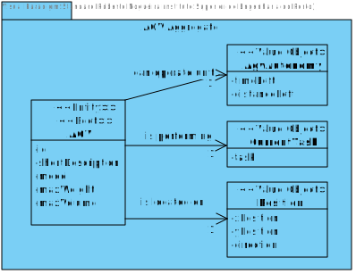
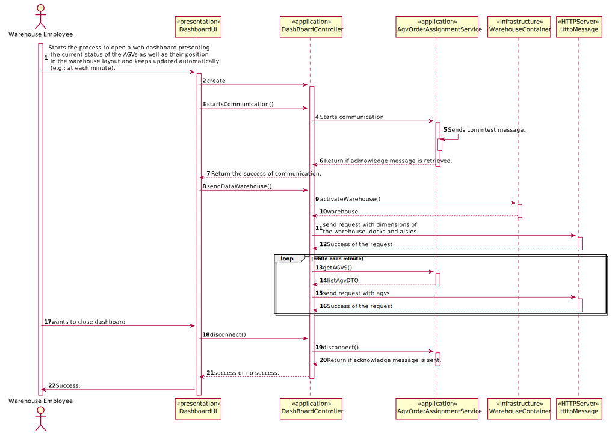
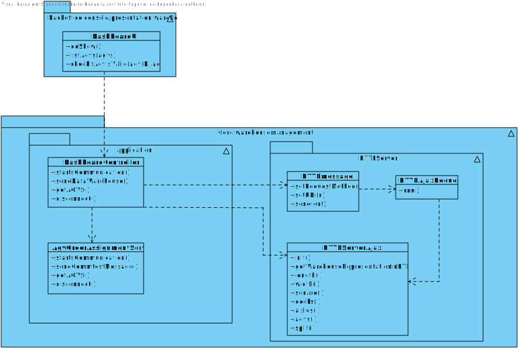

# US2005 - As Warehouse Employee, I want to open a web dashboard presenting the current status of the AGVs as well as their position in the warehouse layout and keeps updated automatically (e.g.: at each minute).
=======================================

# 1. Requirements

* This functionality is to be implemented in the backoffice application, and will be used by Warehouse Employee.

**Q&A with the client**

> **Question:** Regarding this US it is said that "It must be used the provided application protocol (SPOMS2022). The dashboard is intended to be displayed on a web page provided by an existing HTTP server in the ""BackOfficeApp"" application (...)". Our question is, between what applications should the SPOMS protocol be implemented? Should the HTTP server be part of the "BackOfficeApp" and communicate with the AGV Manager using the REQUESTS_API? Or should the HTTP server be its own application and communicate only with the "BackOfficeApp", which on the other hand communicates directly with the database?
>
> **Answer:** As it is being said the "HTTP Server" is part of the "Backoffice Application" in order to provide a local web page only. As so, the "HTTP Server" is a component of the "Backoffice Application". However, a question stands out: where the data to be presented by the "HTTP server" comes from? The "backoffice Application" (or one of its components) must, somehow, get the data from the "AGV Manager" (and/or the system database). In addition, you should notice that the SPOMS2002 protocol relies on the TCP and not on HTTP. There is nothing wrong here. If you still having doubts, I advice you to talk with technical support (in this case, preferably RCOMP lab teachers).

> **Question:** Despite in the provided sprint user stories asking for the digital twin in a web dashboard along with its status and position, in user stories of the next sprint it is said that the development of the movement of the AGV is needed which causes a minor confusion. My question is in this sprint is it required to create the movement of the AGV?
> 
> **Answer:** On Sprint C, the web dashboard needs to be thought and ready to show the current AGVs position, which is read from some where. Further, on sprint D, when simulating the AGV movement the AGV position will change and, therefore, we will be able to see the AGVs position changing accordingly on the web dashboard.

> **Question:** How would you like the dashboard to look? A simple list of the AGVS along with its position and status?
>
> **Answer:** No! Preferably, the dashboard should be an approximation to what is depicted on Figure 8 of the specifications document.

> **Question:** :Despite in the provided sprint user stories asking for the digital twin in a web dashboard along with its status and position, in user stories of the next sprint it is said that the development of the movement of the AGV is needed which causes a minor confusion. My question is in this sprint is it required to create the movement of the AGV?
>
> **Answer:** On Sprint C, the web dashboard needs to be thought and ready to show the current AGVs position, which is read from some where. Further, on sprint D, when simulating the AGV movement the AGV position will change and, therefore, we will be able to see the AGVs position changing accordingly on the web dashboard.

> **Question:** For this sprint do we need to simulate/calculate the draining of the battery? And how about the path that each agv is taking to prepare the order? If not needed, what do we display in the dashboard beside the current status if there is no real-time information about the current position of each agv?
>
> **Answer:** Short answer: no! There is no need to do that on Sprint C. I recommend you to read this post: https://moodle.isep.ipp.pt/mod/forum/discuss.php?d=16277#p20987

# 2. Analysis

## 2.1 What is needed to represent the warehouse:

* Length
* Width
* Square
* All AGV Docks
* All Aisles and Sub Aisles
* AGVs

## 2.2 Relevant Domain Model

The following model represents what is needed to accomplish the functionality, in therms on domain concepts.

* As seen in the diagram above, it is composed only by one aggregate, AGV Aggregate.

# 3. Design

This functionality will be used by Warehouse Employee, a UI will be added to the backoffice application.
This functionality will communicate each minute with the AGV Manager to get all AGV´s.

## 3.1. Sequence Diagram

## 3.2. Class Diagram

## 3.3. Patterns

As every other functionality, this one will follow the architecture defined for the application.
User Interfaces will be in the backoffice app package, controllers and domain will be on the
core package. 

# 4. Implementation

* The implementation follows the design presented above.

# 5. Integração/Demonstração

* The implementation of this User Story is very important because can represent the warehouse, and it is possible to see all the docks, aisles and each minute the position of the AGVs.

# 6. Observações

* There is still work to do on the Dashboard to enhance its functionalities like movement and sensors for each AGV and this will be implemented in SPRINT D.

