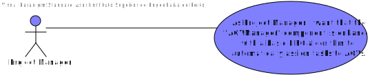

# US-4002 "Assigning orders to Agv automatically"
=======================================

# 1. Requisitos

**US4002** As Project Manager, I want that the "AGVManager" component is enhanced with a basic FIFO algorithm to automatically assign tasks to AGVs.

# 2. Análise

This User story depends on US1004-"As Sales Clerk, I want to create a new products order on behalf of a given customer." and
US2002-"As Warehouse Employee, I want to configure the AGVs available on the warehouse." because there should be Available AGVs as well as products orders.
It also depends on US4001

The team took the initiative to make some questions regarding the simultaneous use of both US2003 & US4002.(https://moodle.isep.ipp.pt/mod/forum/discuss.php?d=16394)

The team also took attention to others students questions(https://moodle.isep.ipp.pt/mod/forum/discuss.php?d=16326)

With all these inputs the team understood that the US should assign available AGVs to product orders that are ready to be assigned. Also this User Story won't work
simultaneously with US2003.

# 3. Design

## 3.1. Realização da Funcionalidade

The US will be executed every minute with an initial delay of 20s to give the application some time to start. When it gets executed the program will search on the database for product orders
that require AGV assignment as well as available AGVs. Then the product orders will be inserted in the linked list ordered by time creation.

Because we store the date of every order reaching every status we can make a query to get the unprepared orders ordered by the oldest of the newest.

Between the assignment of orders we wait a few seconds so the agv digital twin have time to update the order status

## 3.2. Diagrama de Classes

## 3.3. Padrões Aplicados

## 3.4. Testes

There were no tests developed although the server which the US uses is tested.

# 4. Implementação

#Bootstrapp

On the bootstrapp phase the AGVManager will look into the property file and check if the us should be on or off.
If the US is turned on the AGVManager application starts a scheduler which will be executed every 1 minute.

# 5. Integração/Demonstração

*Nesta secção a equipa deve descrever os esforços realizados no sentido de integrar a funcionalidade desenvolvida com as restantes funcionalidades do sistema.*

# 6. Observações

*Initially it was intended that the application would write to a log file a text stating the status of the order but
it couldn't be well implemented. On that that everything that was aimed was achieved.

