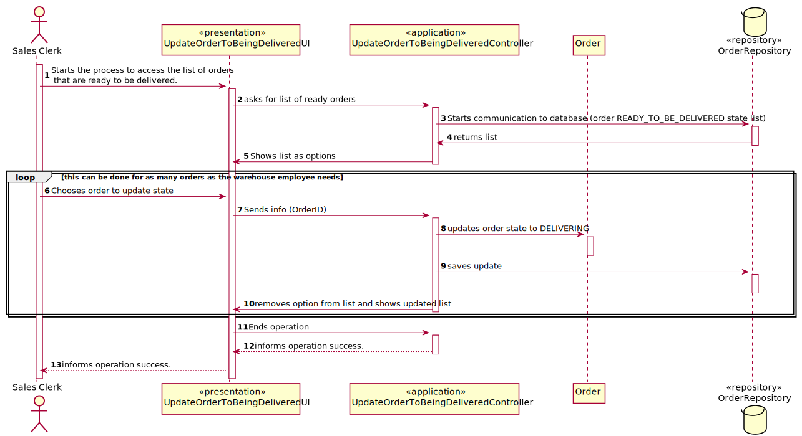
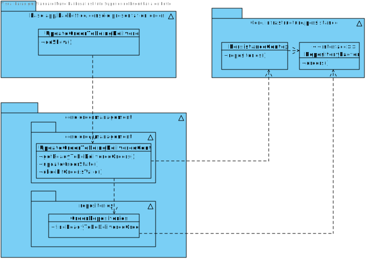

# US1006- As Sales Clerk, I want to access a list of orders that had been dispatched for customer delivery and be able to update some of those orders to as being delivered.
=======================================

# 1. Requirements

* This functionality is to be implemented in the backoffice application, and will be used by Sales Clerk.
# 2. Analysis

## 2.1 What is needed to update the order State

* It is needed the "READY_TO_BE_DELIVERED" Orders.

## 2.2 Relevant Domain Model

The following model represents what is needed to accomplish the functionality, in therms on domain concepts.

* As seen in the diagram above, it is composed by onr aggregates. The Order aggregaye.

# 3. Design

This functionality will be used by Sales Clerk, a UI will be added to the backoffice application.
This functionality will communicate with the OrderRepository to get all the ready orders.
The OrderRepository has the function to persist the Order.

## 3.1. Sequence Diagram

## 3.2. Class Diagram

## 3.3. Patterns

As every other functionality, this one will follow the architecture defined for the application.
User Interfaces will be in the backoffice app package, controllers and domain will be on the
core package. Persistence classes such as the OrderRepository implementations will be on the
Persistence Package, although the interface will remain in the core.

# 4. Implementation

* The implementation follows the design presented above.

# 5. Integração/Demonstração
Implemented succesfully. Only dependency is having orders ready to be delivered in the database.

# 6. Observações

* This User Story is only used when there are ready orders.
