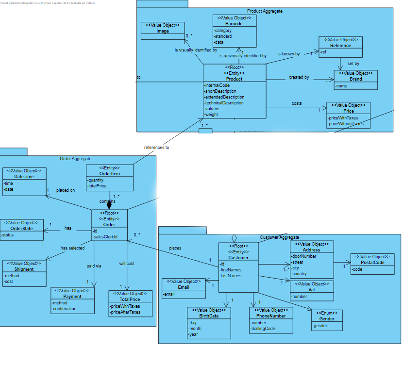
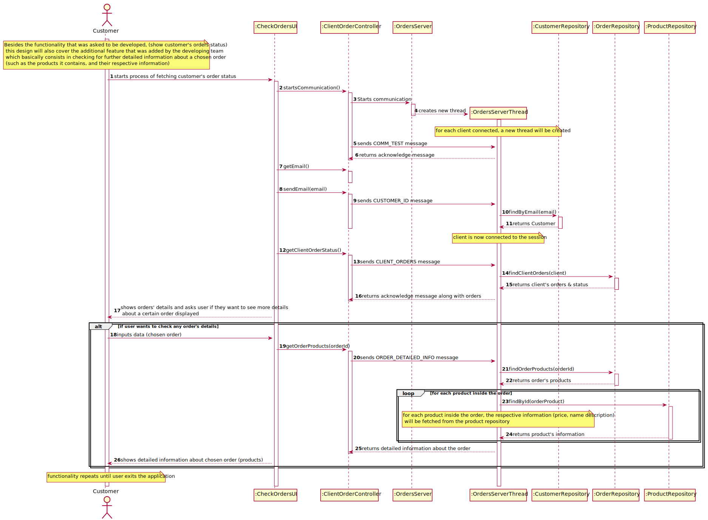
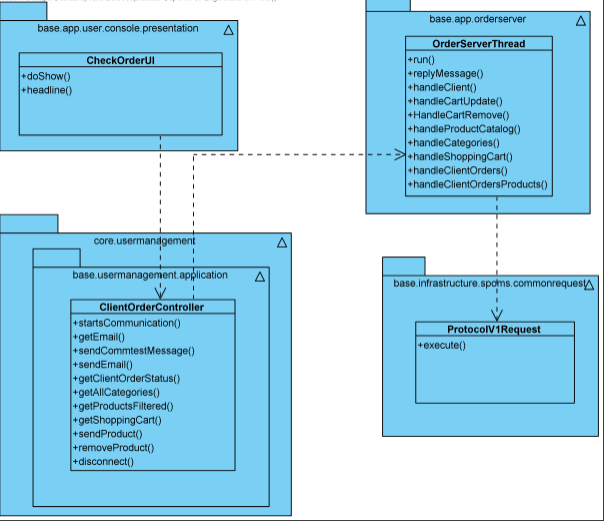

US1501 - As Customer, I want to view/check the status of my open orders.
=======================================

# 1. Requirements

* This functionality is to be implemented in the user application, and will be used by Costumer.

* Only orders that haven't been delivered to the customer will be shown as it was mentioned by the client

### Q : In the US 1502, it is asked to "view/check the status of my open orders", can you clarify if the open orders are all the orders that have been created or if it is orders with a specific status.

### A : "It is all orders that have not been delivered to the customer yet."

[Here](https://moodle.isep.ipp.pt/mod/forum/search.php?id=2760&search=1502)

# 2. Analysis

## 2.1 What is needed to represent Orders:

Existing customer with open orders

## 2.2 RCOMP server messages needed to be created:

| Code | Meaning                                                                                                                                                                                                                                                                    |
|:----:|:---------------------------------------------------------------------------------------------------------------------------------------------------------------------------------------------------------------------------------------------------------------------------|
|  19  | **CLIENT_ORDERS** - Message sent from the Customer Application. An ACK message is returned to the Customer app if the request was successful. *Returns customer's avaliable orders.*                                                                                               |
|  20  | **ORDER_DETAILED_INFO** - Message sent from the Customer Application. An ACK message is returned to the Customer app if the request was successful. *Returns order's detailed information, such as the products it contains.*

## 2.3 Relevant Domain Model

The following model represents what is needed to accomplish the functionality, in therms on domain concepts.

* As seen in the diagram above, it is composed by 3 agregates, Costumer, Order and product.

# 3. Design

This functionality will be used by Customer, a UI will be added to the user application.
This functionality will communicate regularly with the Order Server to get all Products through a controller, using the MVC model.

## 3.1. Sequence Diagram

## 3.2. Class Diagram

## 3.3. Patterns

As every other functionality, this one will follow the architecture defined for the application.
User Interfaces will be in the user app package, controllers and domain will be on the
core package. Server will be in the Order server package

# 4. Implementation

* The implementation follows the design presented above.

* An additional feature was added by the developing team to ensure consistency : When orders are shown to the customer, there will be an option which allows the user to select an order and get further details
about the chosen order. The team thought this functionality would fit well and would add more cohesion to the application

# 5. Integration

* The implementation of this User Story is very important because can represent the user checking his open orders as well as the details of a specific one he chooses

# 6. Observations

* OrderServer must be running for this US to work.
* User must have existing orders for the functionality to be fully used

