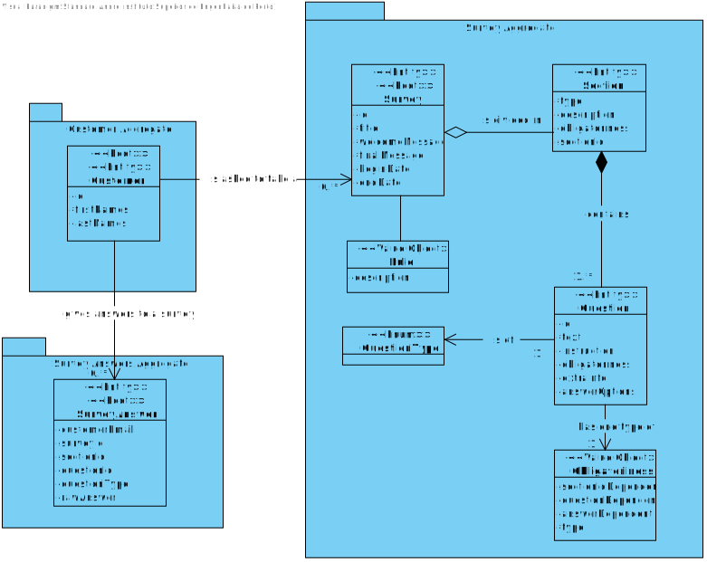
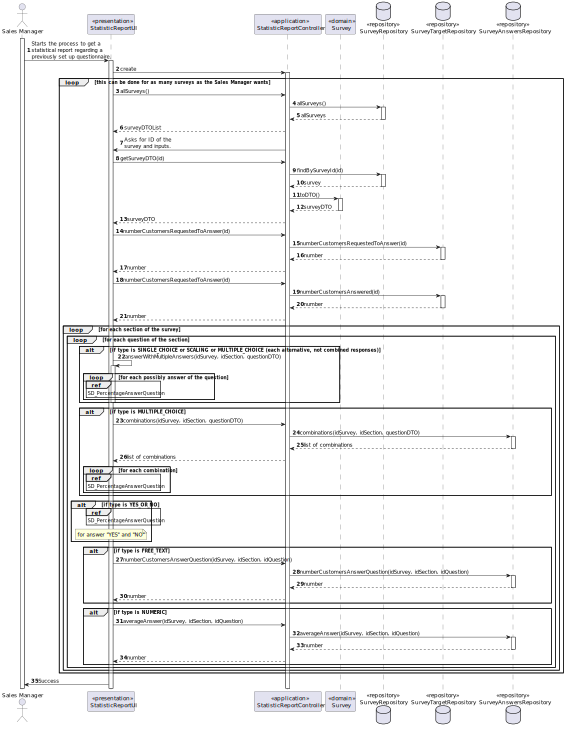
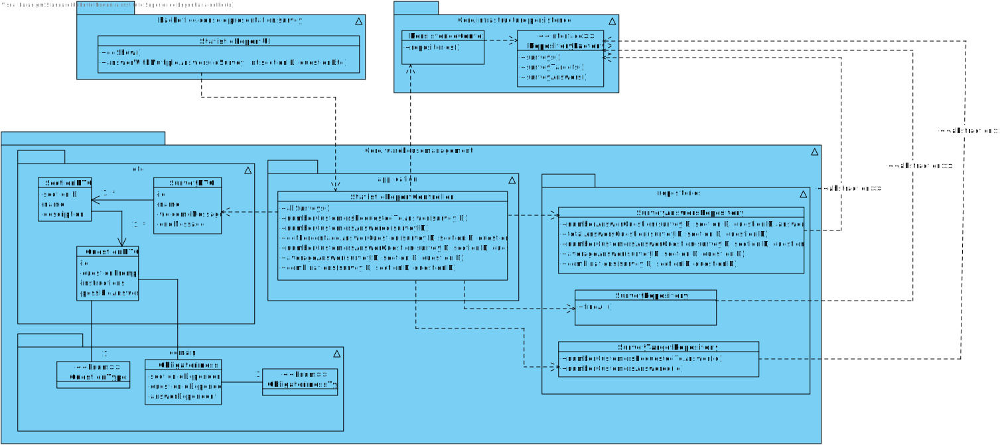

# US3002 - As Sales Manager, I want to get a statistical report regarding a previously set up questionnaire.
=======================================

# 1. Requirements

* This functionality is to be implemented in the backoffice application, and will be used by Sales Manager.

**Q&A with the client:**

> **Question 1:** For this US, does the statistical report need to be shown to the SalesClerk or needs to be saved in some file too (p.e. text file)?
>
> **Answer:** The important is to show the statistical report. Saving the report is not seen as relevant since, at any time, the user might request to see the report again. Notice that the information on which the report is computed is already persisted on the system.

> **Question 2:** For this US, what are the types of statistical report that Sales Clerk want to see?
>
> **Answer:**
 
- Universe Size (implies knowing the amount of users the survey was distributed to);
- Number of Responses Obtained
- % of responses obtained;
  
- Further, something depending on the question type:
- For “Single-Choice” questions:
  - Distribution (in %) of responses for each alternative (e.g.: A = 30%, B = 27%, C = 40%, Others = 3%)
  
- For “Multiple-Choice” questions:
  - Distribution (in %) of responses for each alternative (e.g.: A = 30%, B = 27%, C = 40%, Others = 3%)
  - Distribution (in %) of combined responses (e.g.: A+B = 15%, A+C = 100%, B+C=100%, A+B+C=10%)
  
- For “Sorting-Options” questions:
  - Distribution of the various hypotheses for each position (e.g.: 1st Place = A(40%) B (60%) C(0%); 2nd Place = A(50%) B(40%) C(10%); 3rd Place =A(10%) C(90%))
  
- For “Scaling-Options” questions:
  - Distribution of each option by scale levels.

# 2. Analysis

## 2.1 What is needed to force get a report from a survey:

* Check Question 2.

## 2.2 Relevant Domain Model

The following diagram is extracted from the Domain Model and is an overview of some business concepts that are going to be important in the development of the User Story.

# 3. Design

## 3.1. Sequence Diagram

This functionality will ask the Sales Manager the id of the survey that he wants to see the report. The first steps are: check if the ID of the survey is valid. If so, the controller will get the survey and return the object SurveyDTO to the UI. Next, exists one loop to go through each section. Inside this loop, exists another loop to go through each section. Now, each question has one type and consonant each type, a different method is called to get statistics of each question.

## 3.2. Class Diagram

## 3.3. Patterns

As every other functionality, this one will follow the architecture defined for the application.
User Interfaces will be in the backoffice app package, controllers and domain will be on the
core package. Persistence classes such as the SurveyRepository, SurveyTargetRepository and SurveyAnswersRepository
implementations will be on the Persistence Package, although the interface will remain in the core.

# 4. Implementation

* The implementation follows the design presented above.

# 5. Integração/Demonstração

* The implementation of this User Story is very important because the Sales Manager can see on the report, the universe size, how many responses obtained and information about each question and statistics.

# 6. Observações

* N/A.

