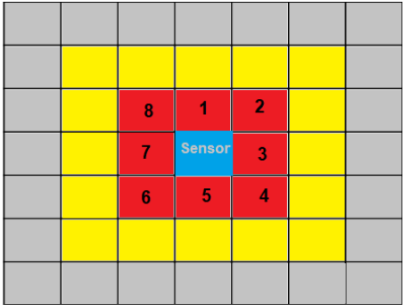

# US5001 - As Project Manager, I want that the team to develop and integrate the others components/parts of the AGV digital twin (e.g.: movement, obstacle sensors, control unit).
=======================================

# 1. Requirements

Communication between AGVManager is required.

# 2. Analysis

## 2.1 Relevant Domain Model

The following model represents what is needed to accomplish the functionality, in therms on domain concepts.

# 3. Design

## 3.1. Sequence Diagram

This part will be divided in sections for better understanding.

## Sensors

The execution of the sensors will be coordinated by the C.U. using semaphores. The simulation engine module will need to 
write on the sensors array the distance from obstacles on the position of the sensor which detected.

As it was suggested we will use 8 sensors. One up, down, left and right and one for each diagonal.

The red squares indicate that they are 1 square away and yellow will be considered two blocks away. As for the grey they will be 3 or more squares
away and will be ignored by the program.
Based on this analysis the sensors will write 1 if the agv should stop and 2 if the agv should slow down. The agv will stop only if there is an obstacle on the path.
For that will use a variable to indicate the direction of the agv.

## 3.2. Class Diagram

## 3.3. Patterns

# 4. Implementation

# 5. Integração/Demonstração

# 6. Observações

